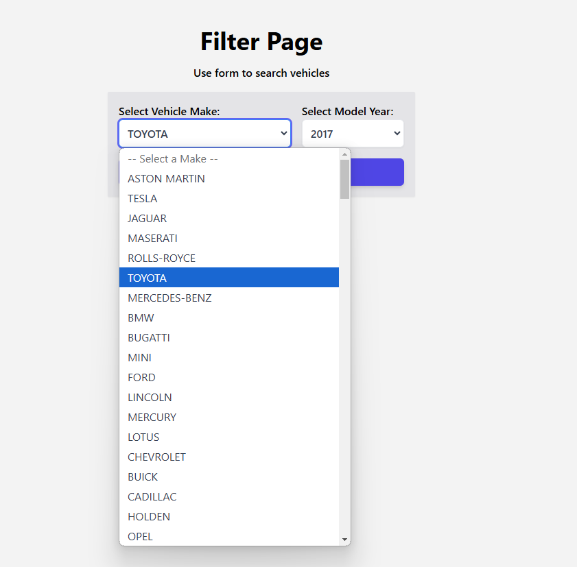

# The Car Dealer App

This application provides a search functionality where users can input a vehicle make and year to get a list of models available for that year.

## This project uses the following technologies:

- Next.js
- Tailwind CSS
- libraries: ESLint, Prettier

## Installation

1. **Clone the repository:**

   To get started, clone the repository to your local machine.

   ```bash
   git clone https://github.com/KatiaOcheretiana/the-car-dealer-app.git
   cd vehicle-data-app
   ```

2. **Install dependencies:**
   I use npm, but you can use yarn instead

   ```bash
   npm install
   ```

3. **Create environment variables:**
   In the root directory, create a .env.local file. This file will store your sensitive data such as API URLs and keys.

   ```bash
   NEXT_PUBLIC_API_URL=https://api.example.com
   ```

## Running the Application

1. **Running the Application**
   Start the development server:

```bash
 npm run dev
```

2. **Access the app:**
   Open your browser and navigate to:

```bash
http://localhost:3000
```

2. **Build the application for production:**
   To build the app for production, run the following command:

```bash
npm run build
```

After building, you can start the production server:

```bash
npm run start
```

## Screenshots

Here are some example screenshots of the app:

# Filter (Home) Page:

There is a form where users can input the make (vehicle manufacturer) and year they are interested in.

Once the make and year are entered, the user can click the "Next" button to retrieve available vehicle models for the selected make and year.


# Result Page:

The Result Page displays the list of vehicle models for the selected make and year after the user submits their search on the Home Page. This page retrieves and displays vehicle model information fetched from the API.


# Not found Page


# Error Handling:

If there is an issue fetching the data (e.g., an invalid make/year combination or API error), an error message will be shown informing the user to try again later.

